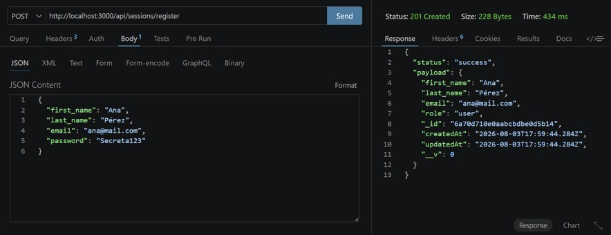
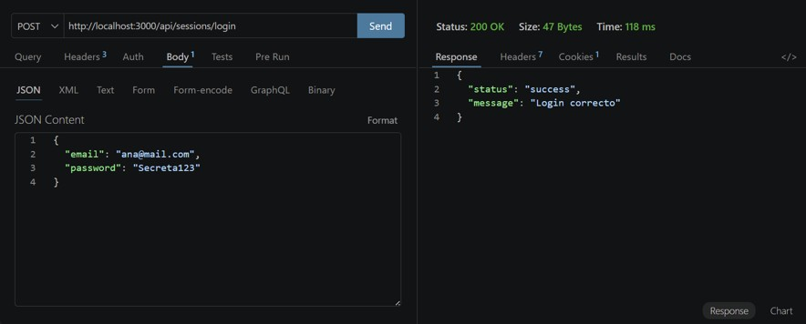
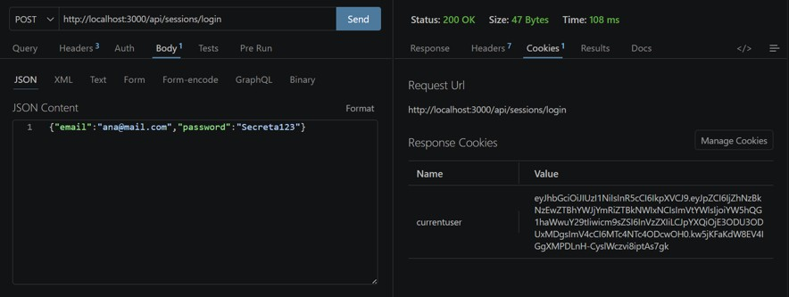
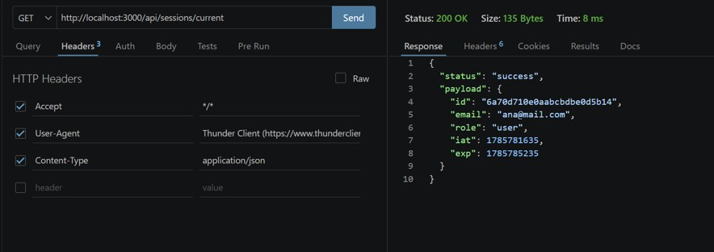
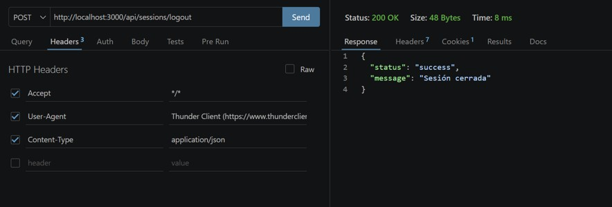
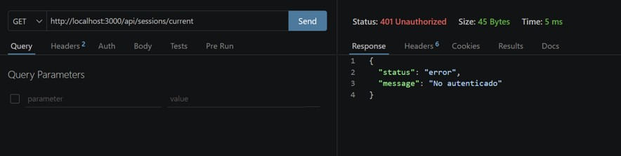
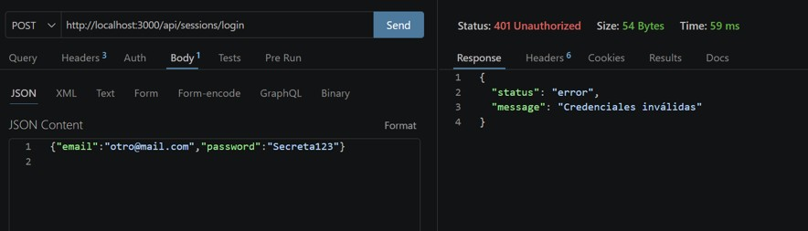
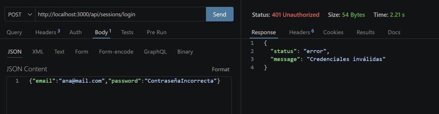
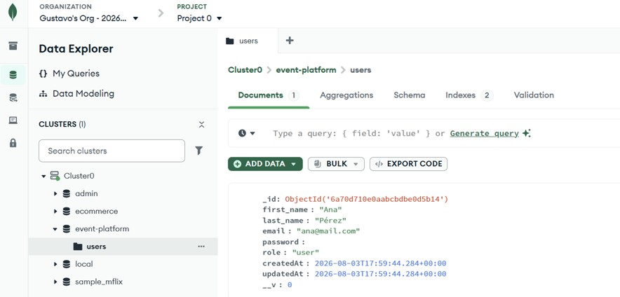

# Pre-entrega 3 — Autenticación con JWT y cookies

## Descripción

Desarrollo de un backend con **Node.js**, **Express**, **MongoDB** y **Mongoose** que implementa un sistema de autenticación completo utilizando **JWT (JSON Web Tokens)** almacenados en **cookies HTTP Only**. El sistema permite registrar usuarios, iniciar sesión, consultar el usuario autenticado y cerrar sesión.

## Tecnologías utilizadas

- **Node.js** - Entorno de ejecución
- **Express** - Framework web
- **MongoDB Atlas** - Base de datos en la nube
- **Mongoose** - ODM para MongoDB
- **JWT** - Autenticación basada en tokens
- **Bcrypt** - Hash de contraseñas
- **Cookie-parser** - Manejo de cookies

## Estructura del proyecto

Pre_entrega_3/  
├── .env.example # Variables de entorno de ejemplo  
├── .gitignore # Archivos ignorados por Git  
├── package.json # Dependencias del proyecto  
├── README.md # Documentación (este archivo)  
└── src/  
├── app.js # Punto de entrada de la aplicación  
├── config/  
│ └── db.js # Conexión a MongoDB  
├── models/  
│ └── User.js # Modelo de usuario  
├── routes/  
│ └── sessions.router.js # Rutas de autenticación  
├── controllers/  
│ └── sessions.controller.js # Controladores de sesión  
├── middlewares/  
│ └── auth.middleware.js # Middleware de autenticación  
└── utils/  
├── jwt.js # Utilidades JWT  
└── hash.js # Utilidades de hash (bcrypt)

## Endpoints de autenticación

### 1. Registro de usuario

**Método:** `POST`  
**URL:** `/api/sessions/register`

#### Request

```json
{
  "first_name": "Ana",
  "last_name": "Pérez",
  "email": "ana@mail.com",
  "password": "Secreta123"
}
```

#### Response - Éxito (201 Created)

```json
{
  "status": "success",
  "payload": {
    "first_name": "Ana",
    "last_name": "Pérez",
    "email": "ana@mail.com",
    "role": "user",
    "_id": "665f2a8c3d4e5f6g7h8i9j0k",
    "createdAt": "2026-08-03T17:59:44.284Z",
    "updatedAt": "2026-08-03T17:59:44.284Z"
  }
}
```

#### Response - Error (400 Bad Request)

```json
{
  "status": "error",
  "message": "El email ya está registrado"
}
```

### 2. Login (iniciar sesión)

**Método:** `POST`  
**URL:** `/api/sessions/login`

#### Request

```json
{
  "email": "ana@mail.com",
  "password": "Secreta123"
}
```

#### Response - Éxito (200 OK)

```json
{
  "status": "success",
  "message": "Login correcto"
}
```

Cookie generada: `currentUser` (HTTP Only, SameSite: Lax, Max-Age: 3600s)

#### Response - Error (401 Unauthorized)

```json
{
  "status": "error",
  "message": "Credenciales inválidas"
}
```

### 3. Obtener usuario autenticado

**Método:** `GET`  
**URL:** `/api/sessions/current`  
**Requerido:** Cookie `currentUser` o Header `Authorization: Bearer <token>`

#### Response - Éxito (200 OK)

```json
{
  "status": "success",
  "payload": {
    "id": "6a70d710e0aabcbdbee0d5b14",
    "email": "ana@mail.com",
    "role": "user",
    "iat": 1785798515,
    "exp": 1785802115
  }
}
```

#### Response - Error (401 Unauthorized)

```json
{
  "status": "error",
  "message": "No autenticado"
}
```

### 4. Logout (cerrar sesión)

**Método:** `POST`  
**URL:** `
/api/sessions/logout`

#### Response - Éxito (200 OK)

```json
{
  "status": "success",
  "message": "Sesión cerrada"
}
```

## Capturas de pruebas realizadas

## 📸 Capturas de pruebas realizadas

### Prueba 1: Registro de usuario (POST /register)

  
_Status: 201 Created - Usuario registrado exitosamente_

### Prueba 2: Login (POST /login)

  
_Status: 200 OK - Login exitoso con cookie generada_

### Prueba 3: Cookie generada en Thunder Client

  
_Cookie `currentUser` visible en la pestaña "Cookies" de Thunder Client_

### Prueba 4: Ruta protegida /current (GET)

  
_Status: 200 OK - Datos del usuario autenticado_

### Prueba 5: Logout (POST /logout)

  
_Status: 200 OK - Sesión cerrada exitosamente_

### Prueba 6: Ruta protegida sin autenticación

  
_Status: 401 Unauthorized - Acceso denegado sin token_

### Prueba 7: Login con email incorrecto

  
_Status: 401 Unauthorized - Credenciales inválidas_

### Prueba 8: Login con contraseña incorrecta

  
_Status: 401 Unauthorized - Credenciales inválidas_

### Prueba 9: Usuario registrado en MongoDB Atlas

  
_Usuario `Ana Pérez` registrado en la colección `users` de MongoDB Atlas_

## Resumen de pruebas

| Orden | Prueba             | Método        | Status | Resultado              |
| ----- | ------------------ | ------------- | ------ | ---------------------- |
| 1     | Registro           | POST/register | 201✅  | Usuario creado         |
| 2     | Login              | POST/login    | 200✅  | Cookie generada        |
| 3     | Cookie             | -             | -      | ✅ HttpOnly: true      |
| 4     | Current (con auth) | GET/current   | 200✅  | Datos del usuario      |
| 5     | Logout             | POST/logout   | 200✅  | Sesión cerrada         |
| 6     | Current (sin auth) | GET/current   | 401❌  | No autenticado         |
| 7     | Email inválido     | POST/login    | 401❌  | Credenciales inválidas |
| 8     | Password inválido  | POST/login    | 401❌  | Credenciales inválidas |
| 9     | MongoDB Atlas      | -             | -      | ✅ Usuario guardado    |

## Variables de entorno

Crear un archivo `.env` basado en `.env.example` con los siguientes valores:

```env
PORT=3000
MONGO_URL=mongodb+srv://<usuario>:<contraseña>@cluster0.xxxxx.mongodb.net/event-platform?retryWrites=true&w=majority
JWT_SECRET=tu_clave_secreta_aqui
JWT_EXPIRES_IN=1h
NODE_ENV=development
```

## Explicación de variables

| Variable       | Descripción                              | Ejemplo                    |
| -------------- | ---------------------------------------- | -------------------------- |
| PORT           | Puerto donde corre el servidor           | 3000                       |
| MONGO_URL      | Cadena de conexión a MongoDB Atlas       | mongodb+srv://...          |
| JWT_SECRET     | Clave secreta para firmar los tokens JWT | mi_clave_super_secreta_123 |
| JWT_EXPIRES_IN | Tiempo de expiración del JWT             | 1h, 7d, 30d                |
| NODE_ENV       | Entorno de ejecución                     | development o production   |

## Instalación y ejecución

### Clonar el repositorio

```bash
git clone https://github.com/Gustrack/event-platform-backend.git
cd event-platform-backend/Pre_entrega_3
```

### Instalar dependencias

```bash
npm install
```

### Configurar variables de entorno

```bash
cp .env.example .env
# Editar .env con tus credenciales reales
```

### Ejecutar en modo desarrollo

```bash
npm run dev
```

### Ejecutar en modo producción

```bash
npm start
```

## Pruebas recomendadas

### Flujo exitoso

✅ Registrar usuario → POST /register  
✅ Iniciar sesión → POST /login  
✅ Obtener usuario autenticado → GET /current  
✅ Cerrar sesión → POST /logout  
✅ Verificar que ya no se puede acceder → GET /current (debe dar 401)

### Casos negativos

❌ Login con email inexistente → 401 "Credenciales inválidas"  
❌ Login con contraseña incorrecta → 401 "Credenciales inválidas"  
❌ GET /current sin cookie → 401 "No autenticado"  
❌ GET /current con token expirado → 401 "No autenticado"

## Verificación en MongoDB Atlas

Para verificar que los usuarios se registran correctamente:

1. Ingresar a [MongoDB Atlas](https://cloud.mongodb.com/)
2. Seleccionar el cluster
3. Ir a "Data Explorer" o "Browse Collections"
4. Buscar la base de datos `event-platform`
5. En la colección `users` deberían aparecer los usuarios registrados

## Cumplimiento de criterios

### Registro

✅ Valida campos obligatorios  
✅ Normaliza email (minúsculas, sin espacios)  
✅ Hashea contraseña con bcrypt  
✅ Rechaza duplicados  
✅ No devuelve password en la respuesta

### Login

✅ Valida presencia de email y password  
✅ Busca usuario por email  
✅ Compara contraseña con bcrypt  
✅ Responde con "Credenciales inválidas" genérico  
✅ Genera JWT con `{ id, email, role }`  
✅ Guarda token en cookie HTTP Only

### Ruta protegida

✅ Middleware auth lee la cookie  
✅ Verifica JWT y guarda payload en `req.user`  
✅ Responde 401 si no hay cookie o token inválido  
✅ Devuelve `{ id, email, role }` sin password

### Logout

✅ Elimina la cookie `currentUser`  
✅ Responde confirmación

### Seguridad

✅ Variables de entorno con `.env`  
✅ `.env.example` incluido  
✅ JWT_SECRET en variables de entorno  
✅ Passwords hasheados  
✅ Cookies HTTP Only

## Recursos adicionales

- [Documentación de MongoDB Atlas](https://www.mongodb.com/es/docs/atlas/)
- [Documentación de JWT](https://www.jwt.io/introduction#what-is-json-web-token)
- [Documentación de Express](https://expressjs.com/)
- [Documentación de Mongoose](https://mongoosejs.com/)

## Autor

Gustavo Atala

## Fecha de entrega

Agosto 2026

## Repositorio

[Github](https://github.com/Gustrack/event-platform-backend)

## Tag

[pre-entrega-3](https://github.com/Gustrack/event-platform-backend/releases/tag/pre-entrega-3)
